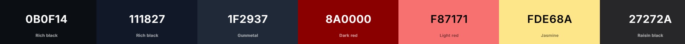
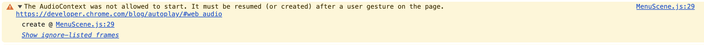

# [Haunted-runner](https://github.com/JakeyMarsh1/haunted-runner)

🎃 ## Game Description: 

Welcome to The haunted Runner, the spookiest (and silliest!) Halloween adventure ever! 👻

**Haunted Runner** is an atmospheric endless runner game built with Phaser 3, designed to deliver an immersive spooky gaming experience. The game combines classic runner mechanics with spooky elements, featuring randomly triggered jumpscares, parallax scrolling backgrounds, and dynamic difficulty progression. The project targets casual gamers, halloween enthusiasts, and players seeking a quick, thrilling gaming experience. With simple controls (spacebar or touch), the game is accessible across devices and skill levels.
The endless runner format keeps sessions short and replayable while layering atmosphere, audio, and mechanics for a cohesive spooky Halloween experience. This project also provided an opportunity to explore game development with Phaser 3, including physics, parallax, scene management, and audio.

It’s fast, it’s fun, and just a tiny bit spooky — but don’t worry, it’s all in good Halloween fun! 🎃✨

---

**Site Mockups**

source: [haunted-runner amiresponsive]()

## UX

### The 5 Planes of UX

#### 1. Strategy

**Purpose**
- Provide users with an engaging endless runner with horror elements
- Deliver smooth controls and responsive gameplay

**Primary User Needs**
- Quick, fun sessions with clear progression
- Intuitive controls
- Performance feedback to encourage improvement

**Business Goals**
- Showcase modern web game development
- Create a memorable, shareable experience

#### 2. Scope

**[Features](#features)** (see below)

**Content Requirements**
- Spooky visuals and backgrounds
- Atmospheric sound effects and music
- Clear UI and smooth transitions
- Responsive controls for mobile and desktop

#### 3. Structure

**Information Architecture**
- **Menu**:
  - Main menu with start options
  - About team page
  - Music toggle
- **Hierarchy**:
  - Prominent start controls
  - Accessible navigation

**User Flow**
1. Land on the menu → optional About
2. Tap or press SPACE to start
3. Run, jump obstacles, react to jumpscares
4. See performance and replay

#### 4. Skeleton

**[Wireframes](#wireframes)** (see below)

#### 5. Surface

**Visual Design Elements**
- **[Colours](#colour-scheme)** (see below)
- **[Typography](#typography)** (see below)

### Colour Scheme

I used [coolors.co](https://coolors.co/080708-0b0f14-111827-1f2937-27272a-8a0000-f87171-fde68a-9ca3af) to generate my color palette.

- `#0b0f14` - Background dark blue-black
- `#111827` - Card backgrounds
- `#1f2937` - Borders and accents
- `#8a0000` - Vignette overlay
- `#f87171` - Primary text and highlights
- `#fde68a` - Secondary highlights
- `#9ca3af` - Subtle text
- `#27272a` - UI elements

### Typography

- [Creepster](https://fonts.google.com/specimen/Creepster) was used for horror titles and UI
- [Inter](https://fonts.google.com/specimen/Inter) was used for body text

## Wireframes

To follow best practice, wireframes were developed for mobile, tablet, and desktop sizes.
I've used [Balsamiq](https://balsamiq.com/wireframes) to design my site wireframes.

| Page | Mobile | Tablet | Desktop |
| --- | --- | --- | --- |
| Menu |  |  |  |
| Game |  |  |  |
| About |  |  |  |

## User Stories

| Target | Expectation | Outcome |
| --- | --- | --- |
| As a user | I want simple, responsive controls | so I can focus on gameplay |
| As a user | I want clear game feedback | so I can track progress |
| As a user | I want atmospheric visuals and audio | for a consistent horror experience |
| As a user | I want smooth performance across devices | so gameplay is reliable |
| As a user | I want accessible difficulty | so I can continue playing |
| As a user | I want quick play sessions | so I can jump in anytime |
| As a user | I want music controls | to customize the experience |
| As a user | I want to see the team | to learn who made the game |

## Features

### Existing Features

| Feature | Notes | Screenshot |
| --- | --- | --- |
| Main Menu | Menu with title, instructions, About, and music toggle. Click/tap or SPACE to start. |  |
| Parallax Background | Multi-layer parallax cemetery for depth. Tiles on demand. |  |
| Player Controls | Space or tap to jump. Variable jump height with early release. Responsive across devices. |  |
| Jumpscares | Random triggers with flash, shake, vignette, and SFX. Inverts controls. |  |
| Music System | Persistent toggle, scene-specific tracks, high-contrast controls. |  |
| About Page | Grid of team members, roles, and links, with circular avatars and smooth transitions. |  |
| Scene Transitions | Fade transitions between scenes. |  |

### Future Features

- **Obstacles**: Add dynamic obstacles to avoid
- **Collectibles**: Candies or items to collect for points
- **Score System**: Track distance, items, and best runs
- **High Score Leaderboard**: Persist via backend/database
- **Difficulty Scaling**: Faster speeds and more obstacles over time
- **Power-ups**: Temporary abilities (e.g., invincibility, speed)
- **Multiple Characters**: Unlockable skins
- **Achievements**: Track accomplishments
- **Mobile Optimization**: Touch input and better layout
- **Dark Mode**: Enhance horror atmosphere
- **Localization**: Multi-language support
- **Game Over**: Finish screen with stats and restart

## Tools & Technologies

| Tool / Tech | Use |
| --- | --- |
|  | Game framework |
|  | Logic and interactivity |
|  | Build tool and HMR |
|  | Styling |
|  | Structure |
|  | Styling |
|  | Version control |
|  | Repository |
|  | IDE |
|  | Hosting |
|  | Wireframes |
|  | Color palette |
|  | Typography |

## Agile Development Process

### GitHub Projects

[GitHub Projects]() served as an Agile tool for this project. Through it, EPICs, User Stories, issues/bugs, and Milestone tasks were planned, then subsequently tracked on a regular basis using the Kanban project board.

### GitHub Issues

[GitHub Issues]() served as another Agile tool. There, we managed the User Stories and Milestone tasks, and tracked any issues/bugs.

| Link | Screenshot |
| --- | --- |
|  |  |
|  |  |

## Testing

> [!NOTE]  
> For all testing, please refer to the [TESTING.md](TESTING.md) file.
## Bug Documentation

### Browser Audio Policy Issue

**Bug Description:**
During initial development, the game's background music failed to play automatically when scenes loaded. The browser console displayed an error indicating that audio playback was blocked due to browser autoplay policies. Modern browsers (Chrome, Firefox, Safari) prevent websites from automatically playing audio until the user has interacted with the page, as a protection against unwanted sound.

**Error Details:**
- Audio context was suspended on page load
- Music would not play when transitioning between scenes
- Console error: "The AudioContext was not allowed to start. It must be resumed (or created) after a user gesture on the page."

**Solution Implemented:**
The issue was resolved by implementing a user-controlled music system:

1. **Music Toggle Button**: Added a music control button (🔇/🔊) that allows users to manually enable/disable audio
2. **MusicManager Utility**: Created a centralized `MusicManager` class that:
   - Initializes music state in Phaser's registry
   - Only plays music after explicit user interaction
   - Persists music preferences across scene transitions
   - Defaults to muted state on game load
3. **User Interaction First**: Music only starts playing when the user clicks the music toggle button, ensuring compliance with browser autoplay policies

This approach not only fixed the autoplay issue but also improved user experience by giving players full control over the game's audio.

## Deployment

### GitHub Pages

The site was deployed to GitHub Pages. The steps to deploy are as follows:

- In the [GitHub repository](https://github.com/JakeyMarsh1/haunted-runner), navigate to the "Settings" tab.
- In Settings, click on the "Pages" link from the menu on the left.
- From the "Build and deployment" section, click the drop-down called "Branch", and select the **main** branch, then click "Save".
- The page will be automatically refreshed with a detailed message display to indicate the successful deployment.
- Allow up to 5 minutes for the site to fully deploy.

The live link can be found on [GitHub Pages](https://github.com/JakeyMarsh1/haunted-runner).

### Local Development

This project can be cloned or forked in order to make a local copy on your own system.

#### Cloning

You can clone the repository by following these steps:

1. Go to the [GitHub repository](https://github.com/JakeyMarsh1/haunted-runner).
2. Locate and click on the green "Code" button at the very top, above the commits and files.
3. Select whether you prefer to clone using "HTTPS", "SSH", or "GitHub CLI", and click the "copy" button to copy the URL to your clipboard.
4. Open "Git Bash" or "Terminal".
5. Change the current working directory to the location where you want the cloned directory.
6. In your IDE Terminal, type the following command to clone the repository:
	- `git clone https://github.com/JakeyMarsh1/haunted-runner.git`
7. Press "Enter" to create your local clone.

**To run locally:**
1. Install dependencies: `npm install`
2. Start the dev server: `npm run dev`
3. Open the localhost URL in your browser

#### Forking

By forking the GitHub Repository, you make a copy of the original repository on our GitHub account to view and/or make changes without affecting the original owner's repository. You can fork this repository by using the following steps:

1. Log in to GitHub and locate the [GitHub Repository](https://github.com/JakeyMarsh1/haunted-runner).
2. At the top of the Repository, just below the "Settings" button on the menu, locate and click the "Fork" Button.
3. Once clicked, you should now have a copy of the original repository in your own GitHub account!

### Local VS Deployment

There are no remaining major differences between the local version when compared to the deployed version online.

## Credits

### Content

| Source | Notes |
| --- | --- |
| [Markdown Builder](https://markdown.2bn.dev) | Help generating Markdown files |
| [Phaser 3 Documentation](https://phaser.io/docs/3.80.0) | Official Phaser 3 docs |
| [Phaser Examples](https://phaser.io/examples) | Examples for features |
| [MDN Web Docs](https://developer.mozilla.org) | JavaScript and web standards |
| [Vite Documentation](https://vitejs.dev/guide) | Vite build tool |
| [ChatGPT](https://chatgpt.com) | Architecture and debugging |

### Media

| Source | Notes |
| --- | --- |
| [Freesound](https://freesound.org) | Sound effects and music |
| [OpenGameArt](https://opengameart.org) | Sprites and backgrounds |
| [Google Fonts](https://fonts.google.com) | Creepster and Inter |
| [TinyPNG](https://tinypng.com) | Image compression |

### Acknowledgements
