# [Haunted-Runner](https://haunted-runner.vercel.app/)

## 🎃 Game Description: 

Welcome to The haunted Runner, the spookiest Halloween adventure ever! 👻

**Haunted Runner** is an atmospheric endless runner game built with Phaser 3, designed to deliver an immersive spooky gaming experience. The game combines classic runner mechanics with spooky elements, featuring randomly triggered jumpscares, parallax scrolling backgrounds, and dynamic difficulty progression. The project targets casual gamers, halloween enthusiasts, and players seeking a quick, thrilling gaming experience. With simple controls (spacebar or touch), the game is accessible across devices and skill levels.
The endless runner format keeps sessions short and replayable while layering atmosphere, audio, and mechanics for a cohesive spooky Halloween experience. This project also provided an opportunity to explore game development with Phaser 3, including physics, parallax, scene management, and audio.

It’s fast, it’s fun, and just a tiny bit spooky — but don’t worry, it’s all in good Halloween fun! 🎃✨

---

**Site Mockups**

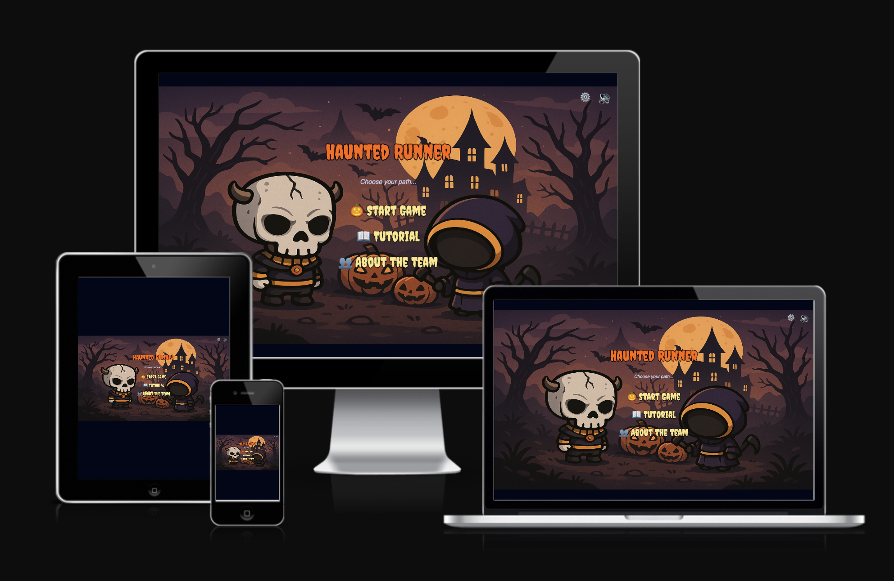

source: [haunted-runner amiresponsive](https://ui.dev/amiresponsive?url=https://haunted-runner.vercel.app/)

## UX

### The 5 Planes of UX

#### 1. Strategy

**Purpose**
- Provide users with an engaging endless runner with horror elements
- Deliver smooth controls and responsive gameplay

**Primary User Needs**
- Quick, fun sessions with clear progression
- Intuitive controls
- Performance feedback to encourage improvement

**Business Goals**
- Showcase modern web game development
- Create a memorable, shareable experience

#### 2. Scope

**[Features](#features)** (see below)

**Content Requirements**
- Spooky visuals and backgrounds
- Atmospheric sound effects and music
- Clear UI and smooth transitions
- Responsive controls for mobile and desktop

#### 3. Structure

**Information Architecture**
- **Menu**:
  - Main menu with start options
  - About team page
  - Music toggle
- **Hierarchy**:
  - Prominent start controls
  - Accessible navigation

**User Flow**
1. Land on the menu → optional About
2. Tap or press SPACE to start
3. Run, jump obstacles, react to jumpscares
4. See performance and replay

**Flowcharts**

Flowchart part 1

 

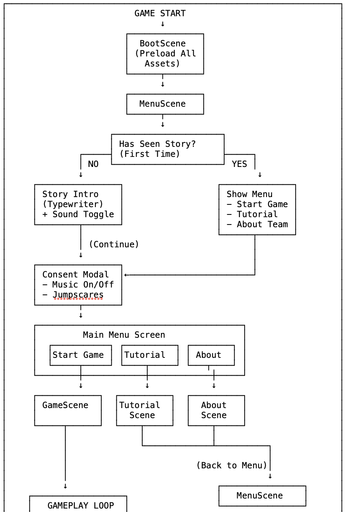 

Flowchart part 2

 

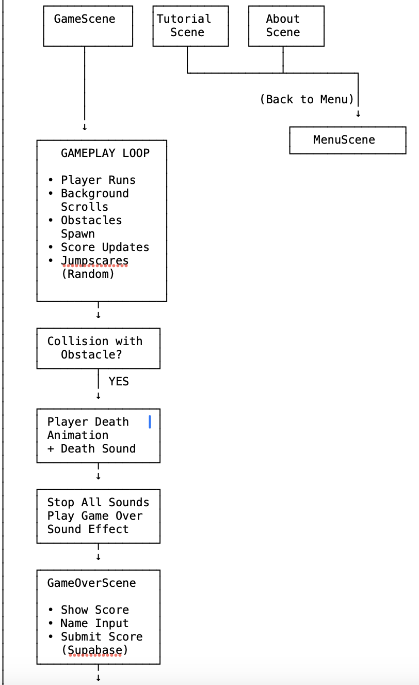 

Flowchart part 3

 

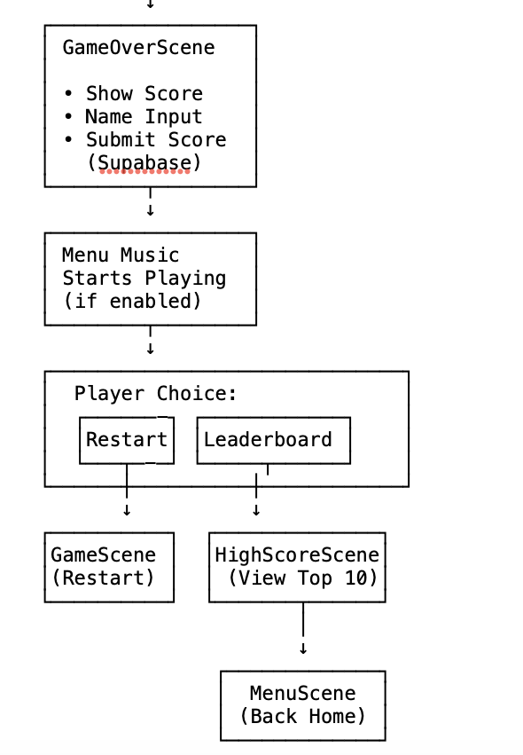 

Audio system logic

 

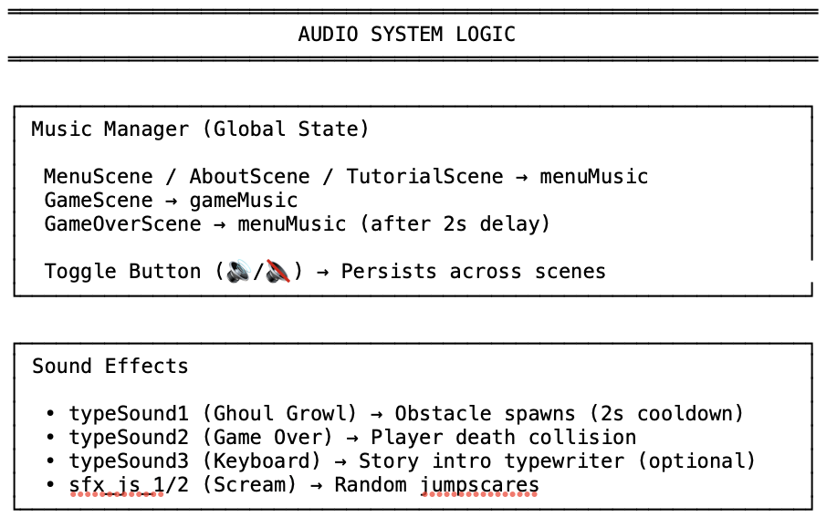  

Key game mechanics

 

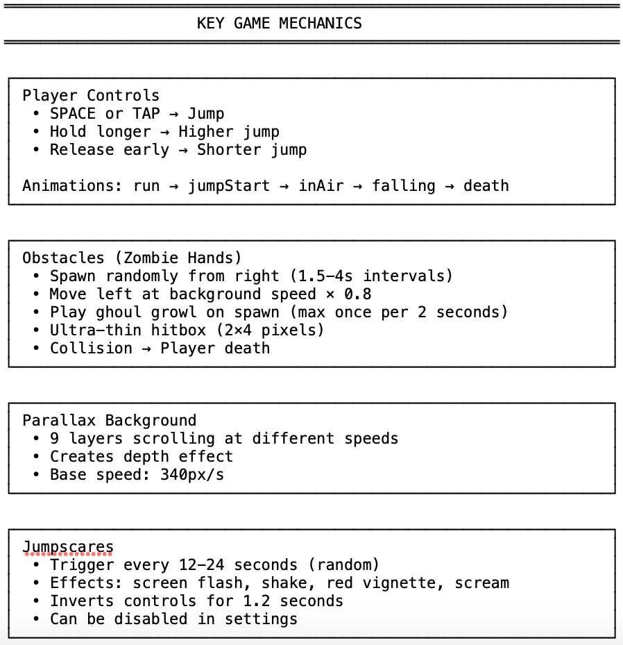 

#### 4. Skeleton

**[Wireframes](#wireframes)** (see below)

#### 5. Surface

**Visual Design Elements**
- **[Colours](#colour-scheme)** (see below)
- **[Typography](#typography)** (see below)

### Colour Scheme

I used [coolors.co](https://coolors.co/080708-1f2937-457460-8a0000-f87171-fde68a-ff6600) to generate my color palette.

- `#080708` - Background dark blue-black
- `#1f2937` - Card backgrounds
- `#457460` - Background green.
- `#8a0000` - Vignette overlay
- `#f87171` - Primary text and highlights
- `#fde68a` - Secondary highlights
- `#9ca3af` - Subtle text
- `#ff6600` - UI elements

### Typography

- [Creepster](https://fonts.google.com/specimen/Creepster) was used for horror titles and UI
- [Inter](https://fonts.google.com/specimen/Inter) was used for body text

## Wireframes

The wireframes were developed for desktop sizes.

| Page | Desktop | 
| --- | --- | 
| Menu | 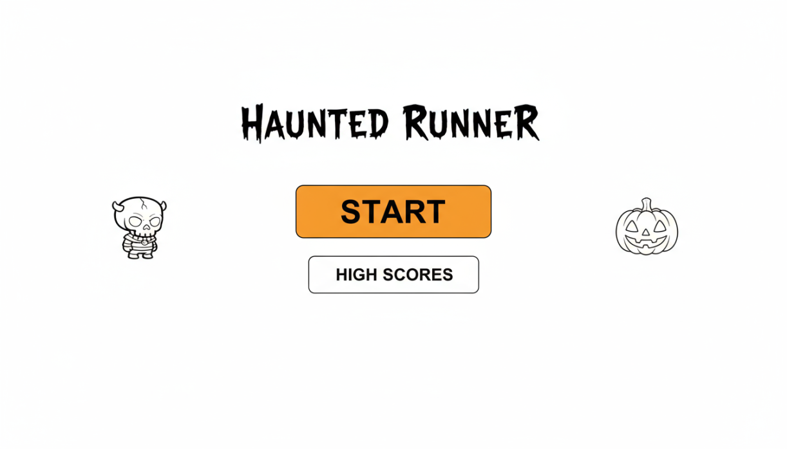 |
| Game |  | 
| GameOver | 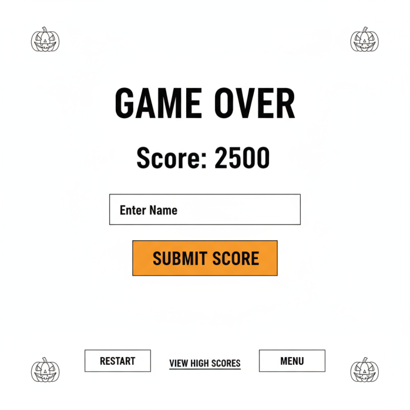 | 
| HighScore | 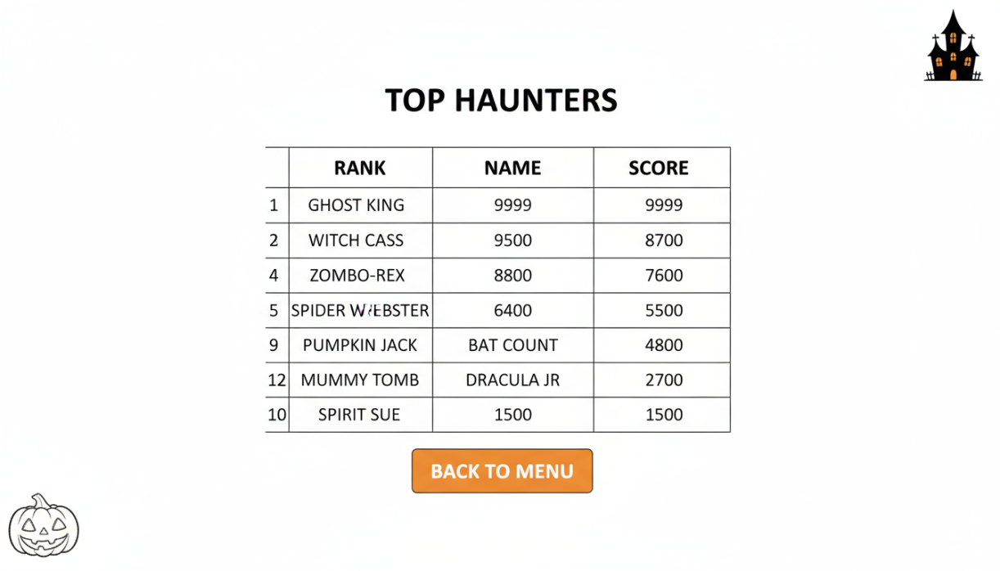 | 

## User Stories

| User Story | Need | So That |
| --- | --- | --- |
| As a player | I want to see an engaging story intro | so I understand the game's narrative and feel immersed in the Halloween atmosphere |
| As a player | I want simple, responsive controls (SPACE or TAP to jump) | so I can focus on gameplay and react quickly to obstacles |
| As a player | I want to access a tutorial before playing | so I can learn the controls and game mechanics without confusion |
| As a player | I want smooth character animations (running, jumping, falling, death) | so the game feels polished and visually engaging |
| As a player | I want to avoid obstacles (zombie hands) | so I can test my reflexes and survive as long as possible |
| As a player | I want to see my score and track my progress | so I can challenge myself to beat my high score |
| As a player | I want atmospheric visuals with parallax scrolling | so I feel immersed in the haunted graveyard setting |
| As a player | I want background music with toggle controls | so I can customize my audio experience and play in any environment |
| As a player | I want smooth scene transitions with fade effects | so the game feels professional and well-designed |
| As a player | I want random jumpscares that temporarily invert controls | so the game remains unpredictable and thrilling |
| As a player | I want to see a dramatic death animation when I collide with obstacles | so failures feel impactful and add to the game's atmosphere |
| As a player | I want quick play sessions with instant restart | so I can jump in anytime and replay easily |
| As a player | I want to learn about the development team | so I can appreciate the creators and their work |
| As a player | I want privacy controls for music and jumpscares | so I have control over my gaming experience |

## Features

### Existing Features

| Feature | Notes | Screenshot |
| --- | --- | --- |
| Intro Scene | Cinematic typewriter-style narrative introducing Skully's story. Sets the Halloween mood with engaging backstory. | 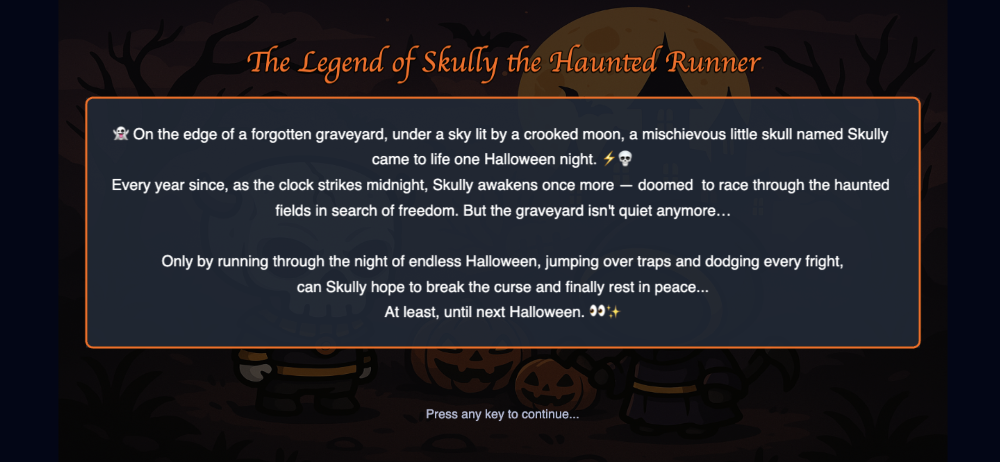 |
| Tutorial Scene | Comprehensive how-to-play guide with clear instructions on game objectives and control. | 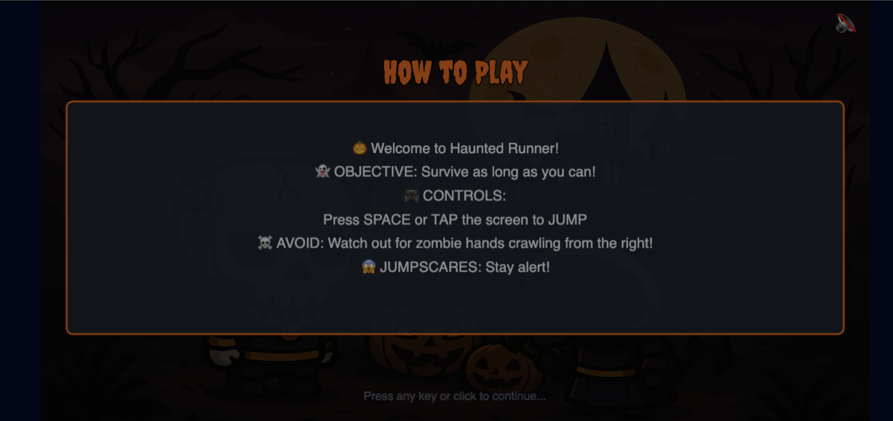 |
| Main Menu | Clean, spooky-themed interface with three primary buttons: Start Game, Tutorial, and About the Team.|  |
| Game Scene | Core gameplay with Skully running through haunted graveyard. Features parallax scrolling cemetery background with 9 separate layers moving at different speeds for depth perception, real-time score tracking, and obstacle spawning system. Includes music toggle and pause (when pressing P ). | 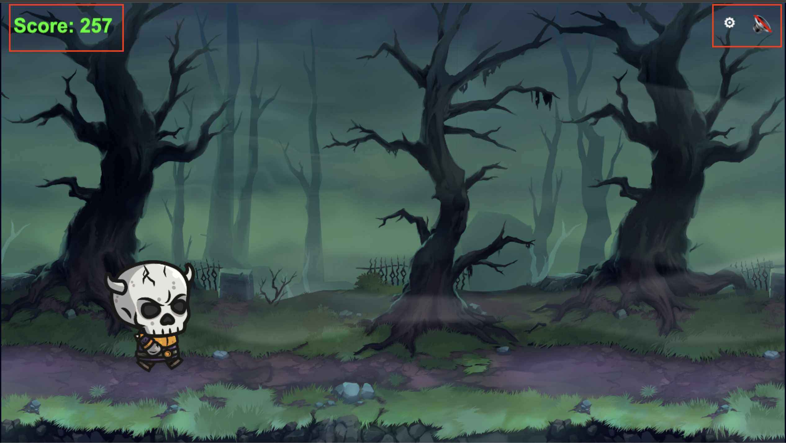 |
| Game Over Scene | Game Over screen displaying final score with input validation for player name. Features "Submit Score" button to save to leaderboard, "Play Again" for instant restart, and "Main Menu" to return. | 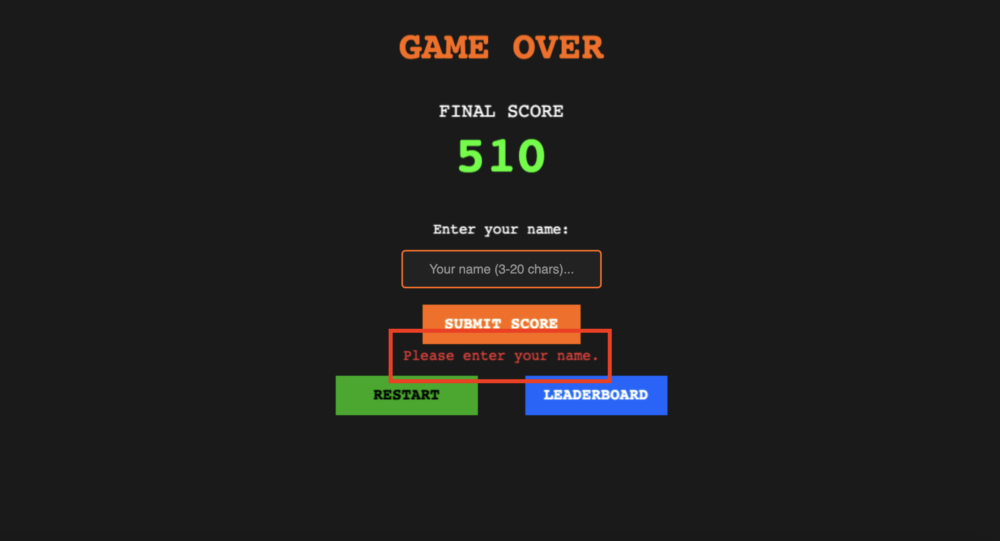 |
| Leaderboard | Top 10 high scores displayed in ranked order with player names and scores. Features "Back to Menu" button and clean table layout. Scores persist across sessions using Supabase backend integration. Scrollable list with orange-themed UI matching game aesthetic. | 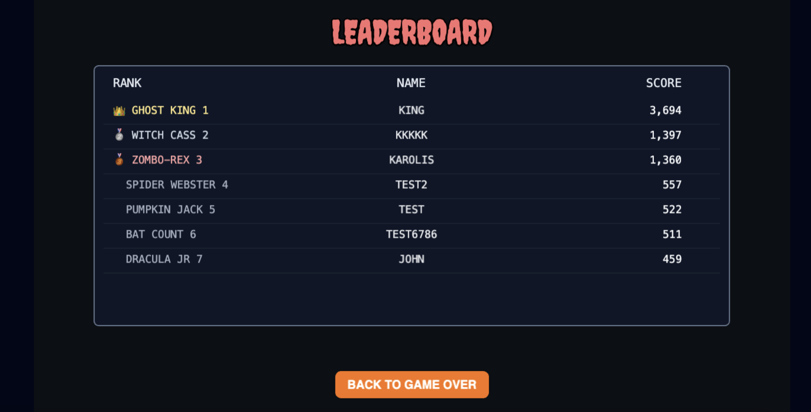 |
| Game Settings | Consent modal appearing on first game load. Allows players to enable/disable background music and jumpscare effects. Features toggle switches, "Save Preferences" button, and persistent storage across sessions. Reopenable via settings gear icon in main menu. | 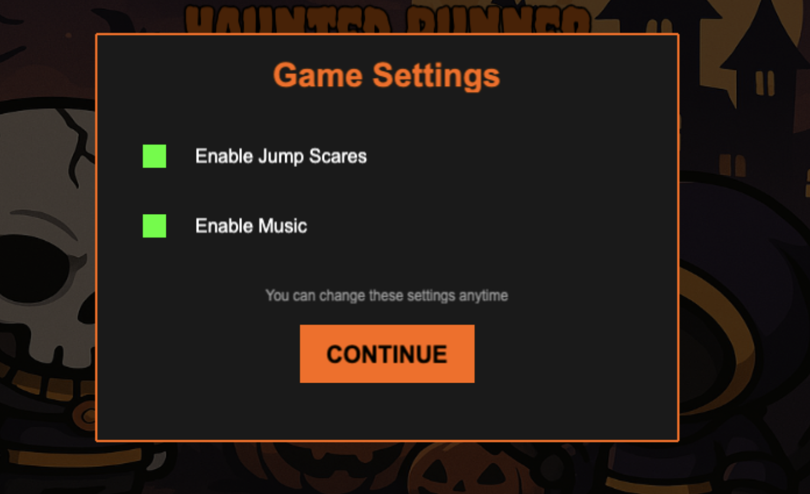 |
| About Page | Grid of team members, roles and social media links (GitHub, LinkedIn). | 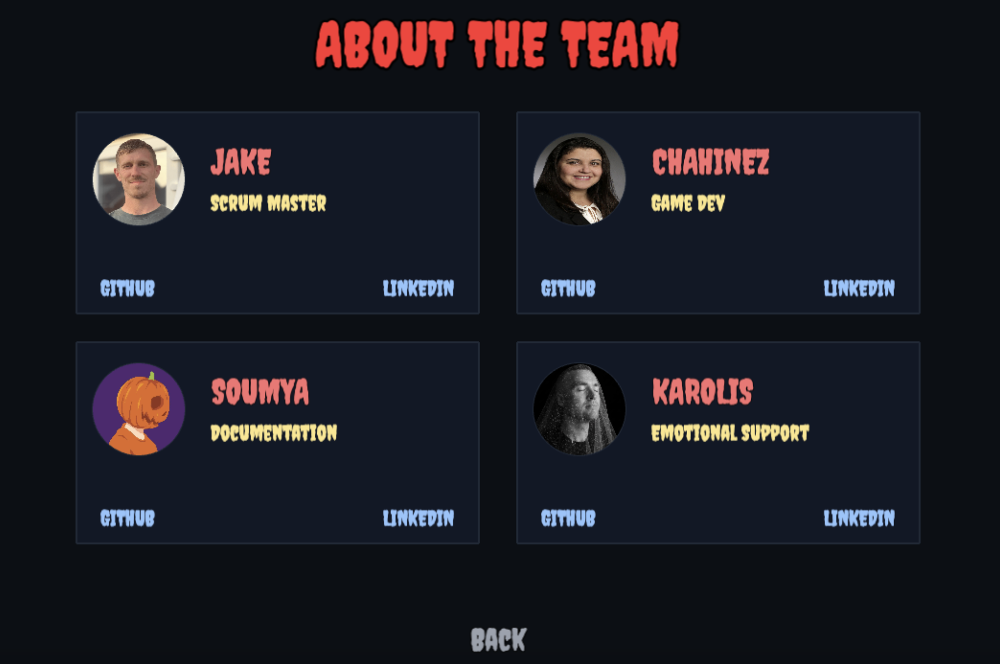 |
| Player Controls | Responsive jump mechanics via SPACE key or screen tap/click. Variable jump height - hold for higher jumps, release early for shorter hops. Smooth animation state machine with 5 states (run, jump start, in-air, falling, death).| 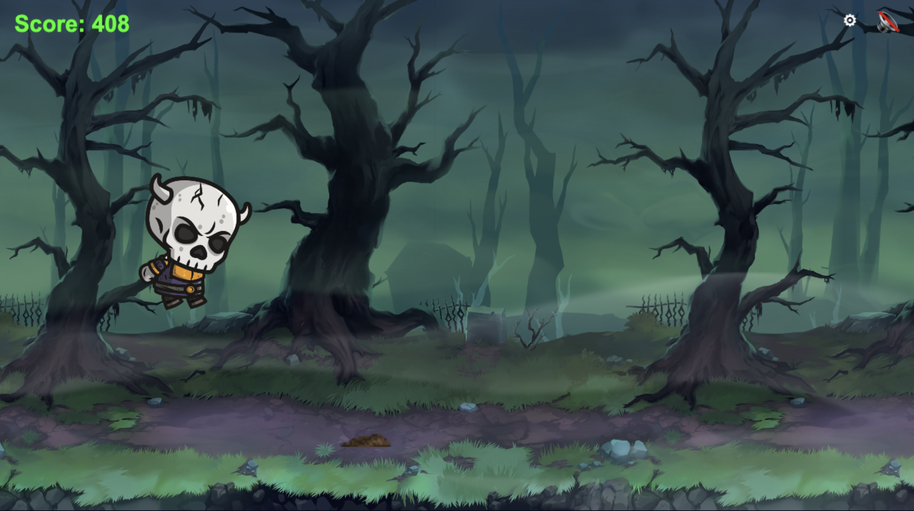 |
| Scene Transitions | Smooth fade-to-black transitions between all scenes (Boot → Menu, Menu → Game, Game → GameOver, etc.). Fade duration of 600-800ms creates professional, cinematic feel. Prevents jarring scene switches and enhances polish. Implemented via reusable SceneTransition utility class. | |
| Jumpscares | Random horror events triggered every 12-24 seconds. |  |

### Future Features

- **Collectibles System**: Add candy, pumpkins, or soul orbs that players can collect for bonus points
- **Difficulty Progression**: Gradually increase game speed and obstacle frequency as the player survives longer
- **Multiple Characters**: Unlock alternative playable characters (ghost, witch, vampire) with unique animations
- **Achievement System**: Track milestones like "Survive 60 seconds", "Jump 100 times", "Collect 50 items"
- **Social Sharing**: Allow players to share their high scores directly to social media platforms
- **Boss Encounters**: Periodic special obstacles or mini-boss characters that require multiple jumps to avoid
- **Multiplayer Race Mode**: Competitive mode where players race side-by-side in real-time

## Tools & Technologies

| Tool / Tech | Use |
| --- | --- |
|  | Game framework |
|  | Logic and interactivity |
|  | Build tool and HMR |
|  | Styling |
|  | Structure |
|  | Version control |
|  | Repository |
|  | IDE |
|  | Hosting |
|  | Wireframes |
|  | Color palette |
|  | Typography |
 

## Bug Documentation

### Browser Audio Policy Issue

**Bug Description:**
During initial development, the game's background music failed to play automatically when scenes loaded. The browser console displayed an error indicating that audio playback was blocked due to browser autoplay policies. Modern browsers (Chrome, Firefox, Safari) prevent websites from automatically playing audio until the user has interacted with the page, as a protection against unwanted sound.

**Error Details:**
- Audio context was suspended on page load
- Music would not play when transitioning between scenes
- Console error: "The AudioContext was not allowed to start. It must be resumed (or created) after a user gesture on the page."

**Solution Implemented:**
The issue was resolved by implementing a user-controlled music system:

1. **Music Toggle Button**: Added a music control button (🔇/🔊) that allows users to manually enable/disable audio
2. **MusicManager Utility**: Created a centralized `MusicManager` class that:
   - Initializes music state in Phaser's registry
   - Only plays music after explicit user interaction
   - Persists music preferences across scene transitions
   - Defaults to muted state on game load
3. **User Interaction First**: Music only starts playing when the user clicks the music toggle button, ensuring compliance with browser autoplay policies

This approach not only fixed the autoplay issue but also improved user experience by giving players full control over the game's audio.

## Deployment

### GitHub Pages

The site was deployed to GitHub Pages. The steps to deploy are as follows:

- In the [GitHub repository](https://github.com/JakeyMarsh1/haunted-runner), navigate to the "Settings" tab.
- In Settings, click on the "Pages" link from the menu on the left.
- From the "Build and deployment" section, click the drop-down called "Branch", and select the **main** branch, then click "Save".
- The page will be automatically refreshed with a detailed message display to indicate the successful deployment.
- Allow up to 5 minutes for the site to fully deploy.

The live link can be found on [GitHub Pages](https://github.com/JakeyMarsh1/haunted-runner).

### Local Development

This project can be cloned or forked in order to make a local copy on your own system.

#### Cloning

You can clone the repository by following these steps:

1. Go to the [GitHub repository](https://github.com/JakeyMarsh1/haunted-runner).
2. Locate and click on the green "Code" button at the very top, above the commits and files.
3. Select whether you prefer to clone using "HTTPS", "SSH", or "GitHub CLI", and click the "copy" button to copy the URL to your clipboard.
4. Open "Git Bash" or "Terminal".
5. Change the current working directory to the location where you want the cloned directory.
6. In your IDE Terminal, type the following command to clone the repository:
	- `git clone https://github.com/JakeyMarsh1/haunted-runner.git`
7. Press "Enter" to create your local clone.

**To run locally:**
1. Install dependencies: `npm install`
2. Start the dev server: `npm run dev`
3. Open the localhost URL in your browser

#### Forking

By forking the GitHub Repository, you make a copy of the original repository on our GitHub account to view and/or make changes without affecting the original owner's repository. You can fork this repository by using the following steps:

1. Log in to GitHub and locate the [GitHub Repository](https://github.com/JakeyMarsh1/haunted-runner).
2. At the top of the Repository, just below the "Settings" button on the menu, locate and click the "Fork" Button.
3. Once clicked, you should now have a copy of the original repository in your own GitHub account!

### Local VS Deployment

There are no remaining major differences between the local version when compared to the deployed version online.

## Credits

### Content

| Source | Notes |
| --- | --- |
| [Markdown Builder](https://markdown.2bn.dev) | Help generating Markdown files |
| [Phaser 3 Documentation](https://phaser.io/docs/3.80.0) | Official Phaser 3 docs |
| [Phaser Examples](https://phaser.io/examples) | Examples for features |
| [MDN Web Docs](https://developer.mozilla.org) | JavaScript and web standards |
| [Vite Documentation](https://vitejs.dev/guide) | Vite build tool |
| [ChatGPT](https://chatgpt.com) | Architecture and debugging |
| [Phaser typewrite documentation](https://github.com/netgfx/Phaser-typewriter?tab=readme-ov-file) | Documentation |

### Media

| Source | Notes |
| --- | --- |
| [Pixabay](https://pixabay.com/) | Sound effects and music |
| [OpenGameArt](https://opengameart.org) | Sprites and backgrounds |
| [Google Fonts](https://fonts.google.com) | Creepster and Inter |
| [TinyPNG](https://tinypng.com) | Image compression |

